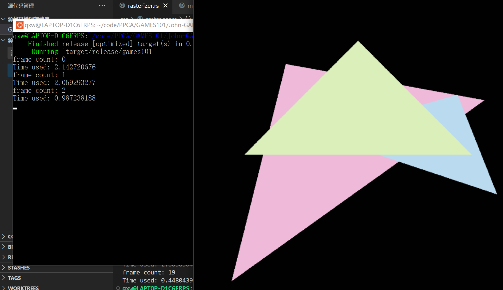

# GAMES101report

## 完成的内容：

首先，在LAB1中，完成了把处在虚拟的三维空间中的三角形通过矩阵乘法，来投影到屏幕上的功能，并且通过旋转矩阵使得三角形可以绕任意指定的轴进行旋转。

其次，在LAB2中，完成了对三角形的渲染，使得实心三角形能够被光栅化，并显示在屏幕上。同时，使用MSAA和TAA两种抗锯齿的方法，让显示出的三角形边缘更加的光滑，减小走样的程度。其中，MSAA是通过对于同一个像素的多次取样来取得一个像素的平均颜色。而TAA则通过将多帧的采样加上抖动，并将它们的结果加以混合，来得到一个像素的平均颜色。由于无法同时保存很多帧，因此，TAA中是将过去帧与当前帧做一个加权平均，来得到多帧的平均：

$$
Color_k = \lambda *Current + (1-\lambda) * Color_{k-1}
$$

这里，我选择的$\lambda$是$1/RoundNum$，因为这样一来得到的$Color_k$就是所有过去帧的平均。

## 光栅器走样的原因

光栅器产生走样最主要的原因其实是屏幕的像素是有限的，因此是不可能完全表现出一条斜向的平滑的直线，因为一定会出现某个像素一半在三角形内部，一半在三角形外部的情况。为了让视觉上看上去形成一条平滑的直线，需要让每个像素的颜色更加接近像素中所有颜色的加权平均值。此时，仅仅在像素的中心来采样判断像素是否在三角形内部，从而来给一个有或没有颜色的赋值就不够了，对每个像素内部再多加采样，才能让像素更加贴近其应该有的颜色。

## 加入抗锯齿前后的时间、及渲染效果对比

### 不加入抗锯齿：

### MSAA:

(取样为每像素25次)

（每像素100次）

### TAA:

(第2轮的结果)

（第60轮的结果）

### 对比分析：

可以看出，再没有加入抗锯齿之前，渲染出的图片中很明显与原来的三角形相比有着失真的现象，而在使用了MSAA或TAA后，三角形的边缘变得更加的光滑。

从时间来看，不加抗锯齿与TAA几乎没有什么太大的差别，而MSAA在每个像素的取样数较多时则相比较而言会运行的比较慢。

TAA和MSAA的区别在于TAA在刚开始的几帧中表现较差，需要等帧数增加后才趋于一个比较好多结果，但每帧的速度较快，而MSAA每帧的结果几乎不变，但是渲染的速度会慢一些。
